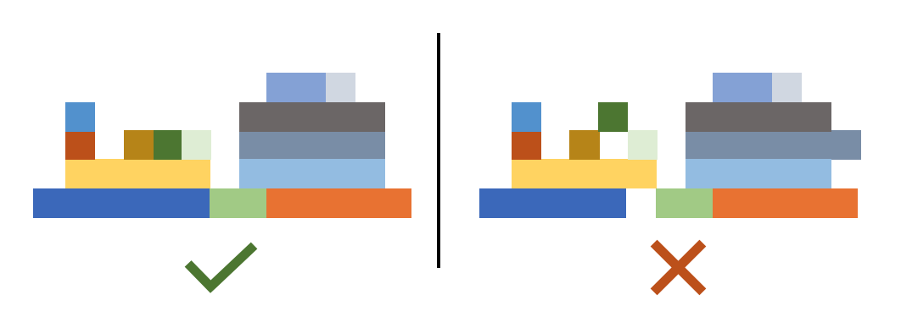
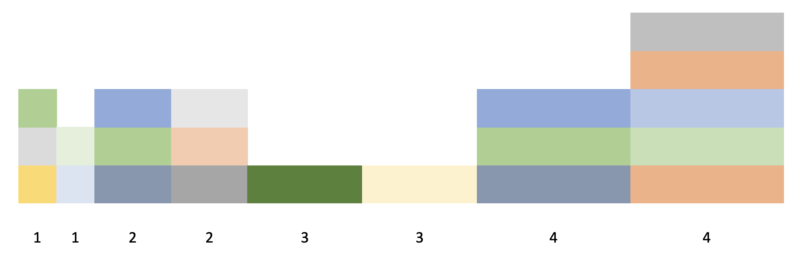
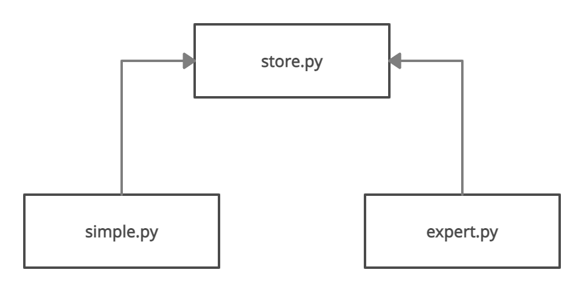

# Pràctica GCED-AP2 2022


## Introducció

Ens trobem en un magatzem de contenidors. Els contenidors són tots de la mateixa alçada i de la mateixa fondària però tenen amplades diferents: les amplades possibles són 1, 2 3 o 4 unitats. El magatzem  emmagatzema els contenidors en una única fila, d'una amplada limitada, típicament de 20 a 30 unitats d'amplada. Els contenidors es poden emmagatzemar els uns damunt dels altres, amb una alçada arbitràriament gran. Però per raons de pes, seguretat i estructura, cada contenidor ha de reposar completament damunt d'altres contenidors: no pot haver-hi cap forat a sota.

A la figura següent, a l'esquerra es veu un magatzem amb diferents contenidors ben col·locats, a la dreta un magatzem amb tres contenidors mal col·locats.



Una grua és capaç de posar, treure i moure contenidors al magatzem. Quan arribi un contenidor nou, la grua el pot agafar i deixar en alguna posició del magatzem, sempre que aquesta sigui legal. Quan calgui treure un contenidor del magatzem, la grua el pot alçar i retirar, a condició que aquest contenidor no tingui cap contenidor damunt seu. La grua també pot moure contenidors dins del magatzem: aixecant-lo primer i deixant-lo després en un altre lloc. Cada acció de la grua (posar, treure o moure) triga exactament una unitat de temps (per exemple, un minut).

Els contenidors arriben seqüencialment a les portes del magatzem. Des del moment que arriba un contenidor fins que arriba el següent, la grua pot anar fent accions, inclosa la d'afegir el contenidor al magatzem. Quan un nou contenidor arriba, els anteriors ja no es poden afegir mai més.

Cada contenidor té doncs un temps d'arribada a l'entrada del magatzem (per exemple, les 10:30) i s'hi estarà fins que sigui emmagatzemat o que arribi el proper contenidor (per exemple, a les 11:35). A més, cada contenidor també té un període de lliurament (per exemple, entre les 12:05 i les 13:00) i
un valor econòmic associat. Aquest valor només serà guanyat pel magatzem si aquest contenidor és emmagatzemat i extret dins del seu intèrval de lliurament. Sempre es poden treure contenidors del magatzem (i aquests no es poden tornar a agafar mai més), però només els que surtin dins de l'interval de lliurament comportaran un benefici.

Per tal de guanyar tants diners com sigui possible, el director del magatzem us ha contractat per tal que dissenyeu i implementeu estratègies per gestionar el magatzem. Heu de decidir doncs quins contenidors entrar o no al magatzem i quan fer-ho, quins contenidors treure del magatzem i quan fer-ho, i com anar reorganitzant els contenidors dins del magatzem. La vostra estratègia serà provada tot simulant-la amb unes dades d'entrada públiques i privades. Les privades tindran unes característiques semblants a les públiques.

De fet, cal que implementeu dues estratègies: la primera s'anomena *L'estratègia de les dues piles* i hauria de funcionar (essencialment) igual per tothom. La segona és la vostra pròpia estratègia i l'hauríeu de fer millor que les de la competència!


## L'estratègia simple

Aquesta estratègia es basa en emmagatzemar tots els contenidors de la mateixa mida en dues piles cadascuna. Així, mai hi ha contenidors de diferents mides els uns damunt dels altres ni esglanoats. Aquest seria l'aspecte d'un magatzem que segueix aquesta estratègia:



L'estratègia funciona de la forma següent:

1. Quan arriba un contenidor nou, aquest és dipositat immediatament a la primera pila de la seva mida.

2. A continuació, per a cada mida de contenidor (és a dir, de 1 a 4)

    1. Tots els contenidors de la primera pila d'aquella mida són transferits (de dalt a baixa) a la segona pila d'aquella mida.

    2. Tots els contenidors de la segona pila d'aquella mida són transferits (de dalt a baixa) a la primera pila d'aquella mida.

        Atenció:

    - Si durant aquests dos passos anteriors es troba algun contenidor caducat, aquest és extret del magatzem.

    - Igualment, si es troba algun contenidor que pot augmentar el benefici en aquell moment, aquest també és extret del magatzem (tot augmentant els diners guanyats).

    - Si el temps assignat s'esgota, cal deixar de tractar contenidors.

    - Si no es pot fer cap acció, es perd aquella unitat de temps.

3. Si encara queda temps, es torna al pas 2.

Podeu veure una execució d'aquesta estratègia a [YouTube](https://youtu.be/kdNeYi99qjo).


## L'estratègia experta

L'estratègia experta és una estratègia que vosaltres heu de dissenyar. Ha de ser original vostra i ha de maximitzar el benefici obtingut amb un joc de proves que coneixereu després del lliurament.


## Funcionament de la pràctica

Aquesta pràctica té dues parts:

1.  A la primera part heu d'escriure un mòdul per gestionar magatzems de  contenidors i dues estratègies per entrar-hi i treure'n contenidors. La primera estratègia és l'estratègia simple explicada anteriorment. La segona estratègia és la vostra estratègia experta.

    Heu de lliurar la pràctica a través de l'aplicació Eduflow. Per a fer-ho, aneu a https://app.eduflow.com/join/EPZ6Y9. A continuació, creu un nou compte introduint el vostre nom complet, el vostre correu electrònic oficial (acabat amb `@estudiantat.upc.edu`) i una contrasenya (recordeu-la!). Lliureu en un fitxer ZIP tots els fitxers necessaris però tingueu cura de **NO** identificar-ne cap amb el vostre nom o altre informació personal vostra: el vostre lliurament ha de ser completament anònim.

    La data límit per lliurar la primera part de la vostra pràctica és el dimarts 12 d'abril de 2022 fins a les 23:59.

2.  A la segona part de la pràctica haureu de corregir tres pràctiques d'altres companys. Aquesta correcció es farà també a través de Eduflow i implicarà valorar diferents rúbriques que només veureu en aquest punt.

    L'avaluació també serà anònima. El sistema calcularà automàticament la nota de cada estudiant i també avisarà als professors de possibles incoherències. Els abusos seran penalitzats. Cada estudiant té el dret de rebutjar la nota rebuda pels seus companys i pot demanar l'avaluació per part d'un professor (qui podrà puntuar a l'alta o a la baixa respecte l'avaluació dels estudiants). Els professors també poden corregir pràctiques "d'ofici" i substituir la nota rebuda pels companys per la del professor.

    Podeu començar a corregir les pràctiques dels vostres companys a partir del dijous 14 d'abril a les 8:00. La data límit per lliurar la segona part de la vostra pràctica és el dimarts 26 d'abril a les 23:59. No podreu veure les correccions dels vostres companys fins que no hagueu donat les vostres correccions.

Totes les pràctiques s'han de fer en solitari. Els professors utilitzaran programes detectors de plagi. És obligatori corregir les pràctiques dels tres companys assignades pel sistema.


## Disseny del sistema

El vostre sistema tindrà tres mòduls en Python:

- `store.py`: Aquest mòdul contindrà els tipus, classes i funcions relacionats amb la gestió dels magatzems i contenidors.

- `simple.py`: Aquest mòdul contindrà el codi relacionat amb la vostra implementació de l'estratègia simple.

- `expert.py`: Aquest mòdul contindrà el codi relacionat amb la vostra implementació de l'estratègia experta.

Aquesta és el diagrama de mòduls:



Per als tres mòduls, ja us donem un esquelet amb la interfície que haureu de seguir i implementar. No teniu dret a canviar la interfície pública, però evidentment, podeu afegir les parts privades que us convinguin. Si us cal, també podeu extendre la interfície pública, però sempre preservant la que se us ha donat. A més, per estalviar-vos feina, algunes operacions ja se us dónen implementades (per exemple, les de visualització o execució d'estratègies).

Aquests són els fitxers de l'esquelet:

- [store.py](templates/store.py)
- [simple.py](templates/simple.py)
- [expert.py](templates/expert.py)


## El mòdul `store.py`

Aquesta mòdul està estructurat al voltant d'uns quants tipus que representen les entitats del problema.

### TimeStamp

El tipus `TimeStamp` representa un moment en el temps. És equivalent a un `int`.

### Position

El tipus `Position` representa la posició de l'extrem esquerre d'un contenidor en un magatzem. És equivalent a un `int`. La posició més a l'esquerra és 0.

### Location

El tipus `Location` representa la posició d'un contenidor en un magatzem. És una tupla de dos enters que representa la fila i la columna (extrem esquerre) on es troba un contenidor. La fila inferior i la columna esquerra tenen índex 0.

### TimeRange

L'estructura `TimeRange` representa un interval de temps entre dos timestamps.
Té dos camps, el temps d'inici i el de final.
Seguint la convenció de Python,
el temps de final no està inclòs en l'intèrval.

```python3
@dataclass
class TimeRange:
    start: TimeStamp
    end: TimeStamp
```

### Container

L'estructura `Container` representa contenidors. N'emmagatzema el seu identificador, la seva amplada, el seu valor, el seu període d'arribada i el seu període de lliurament:

```python3
@dataclass
class Container:
    identifier: int
    size: int
    value: int
    arrival: TimeRange
    delivery: TimeRange
```

Segurament voldreu afegir-li altres mètodes, per exemple, per saber si
en un moment donat el contenidor està caducat o no.

### Store

La class `Store` representa un magatzem. Els magatzems es creen amb una amplada i han d'implementar els mètodes següents:

```python3
class Store:
    def __init__(self, width: int): ...
    def width(self) -> int: ...
    def height(self) -> int: ...
    def cash(self) -> int: ...
    def add_cash(self, amount: int) -> None: ...
    def add(self, c: Container, p: Position) -> None: ...
    def remove(self, c: Container) -> None: ...
    def move(self, c: Container, p: Position) -> None: ...
    def containers(self) -> List[Container]: ...
    def removable_containers(self) -> List[Container]: ...
    def top_container(self, p: Position) -> Optional[Container]: ...
    def location(self, c: Container) -> Location: ...
    def can_add(self, c: Container, p: Position) -> bool: ...
    def can_remove(self, c: Container) -> bool: ...
    def write(self, stdscr: curses.window, caption: str = ''): ...
```

El significat de cada mètode hauria de ser prou clar pel seu nom i paràmetres, però és necessari que el feu explícit amb una especificació completa usant *docstrings*. Tots els mètodes haurien de llançar una excepció si s'executen amb paràmetres invàlids. Deixeu-ho també especificat.

Quan implementeu la classe `Store`, suposeu que l'amplada i l'alçada del magatzem poden ser molt grans. Això afectarà la tria de les estructures de dades subjacents.

El mètode `write` ja se us dóna implementat usant la resta d'operacions públiques. Aquest utilitza la llibreria `curses` per poder escriure en coloraines en un terminal.

Fixeu-vos que l'`Store` no té coneixement del pas del temps.


### read_containers

La funció `read_containers` ja se us dóna implementada i retorna la llista de contenidors continguts en el fitxer que se li passa com a paràmetre:

```python3
def read_containers(path: str) -> List[Container]:
```

El format d'aquest fitxer és senzill: a cada línia es dóna la descripció d'un contenidor amb els seus atributs: identificador, mida, valor, període d'arribada (start i end), període de lliurament (start i end).
Aquest és un exemple de fitxer de contenidors:

```
10 3 3 0 21 102 283
21 3 8 21 28 295 521
23 1 1 28 29 32 127
13 6 28 29 40 186 476
11 6 5 40 75 131 314
```

Tots els identificadors són diferents. Fixeu-vos que el perióde d'arribada acaba quan comença el perióde d'arribada del següent contenidor. En aquest exemple, la simulació acaba al temps 74 (inclòs).

### Logger

La senzilla classe `Logger` serveix per registrar tots els moviments que una estratègia realitza en un magatzem. Ja se us dóna implementada.

El registre es desa en un fitxer de text i serveix per poder comprovar que totes les accions realitzades per les estratègies són correctes i per poder visualitzar com evoluciona el magatzem al llarg del temps.

Fixeu-vos que l'`Store` no en sap res del `Logger`, són les estratègies qui el faràn servir.

Els fitxers de registre són senzills: cada acció es desa en una línia amb la marca de temps en què s'ha realitzat. És convenient també desar-hi el benefici obtingut després de cada extracció de contenidor a temps. Aquest és un exemple de fitxer de registre:

```
0 START MyStrategy 20
0 ADD 0 12
1 CASH 0
1 ADD 1 6
2 CASH 0
2 REMOVE 1
2 CASH 6
3 MOVE 0 16
4 MOVE 0 12
5 CASH 6
```

### check_and_show

La funció `check_and_show` serveix per comprobar (en certa mesura) que un fitxer de registre és correcte.
A més, també serveix per visualitzar l'evolució del magatzem al terminal. Ja se us dóna implementada utilitzant les operacions públiques de `Store`.

```python3
def check_and_show(containers_path: str, log_path: str, stdscr: Optional[curses.window] = None):
```

## El mòdul `simple.py`

El mòdul `simple.py` conté el codi de l'estratègia simple. Aquesta es realitza a través de la classe `Strategy`:

```python3
class Strategy:
    def __init__(self, width: int, log_path: str): ...
    def cash(self) -> int: ...
    def exec(self, c: Container): ...
```

Cada estratègia es crea amb una amplada del magatzem i un nom de fitxer on es registraran les accions que la estretègia aplica al magatzem.

El mètode `exec` és el cervell de l'estratègia i s'executa cada cop que arriba un nou contenidor. Llavors, aquest `exec` pot realitzar tantes accions de la grua com hi hagi dins de l'intèrval de temps de l'arribada del contenidor.

El mòdul `simple.py` també ofereix una funció `main` que serveix per executar el programa. Podeu veure que simplement executa l'estratègia usant tres paràmetres donats a la línia de comandes: nom del fitxer de contenidors, nom del fitxer de registre i amplada del magatzem. Podeu comentar/descomentar la línia del `check_and_show` per habilitar o deshabilitar la comprovació i visualització. El `main` és essencialment un capa per damunt de
la funció `execute_strategy(containers_path: str, log_path: str, width: int)` que s'encarrega de llegir els contenidors i anar cridant a `exec`.

El `main` també inclou unes instruccions necessàries per inicialitzar la llibreria `curses`, que s'encarrega de preparar les coloraines i posicionament dels textos al terminal. Podeu ignorar-ne els detalls.


## El mòdul `expert.py`

El mòdul `expert.py` és exactament igual que el `simple.py`, tret que ha d'implementar la vostra estratègia experta. Expliqueu en un comentari inicial el funcionament i elements més importants de la vostra estratègia i les seves raons.


## Jocs de proves

Al directori [tests](tests) teniu els jocs de proves públics (llistes de contenidors). Ara mateix només n'hi ha un ([simple.txt](tests/simple.txt)) amb 100 contenidors, però aviat en posarem un de més llarg, semblant al privat que es publicarà després del lliurament.


## Consells

Per realitzar el treball us recomanem seguir aquests passos:

1. Implementeu el mòdul `store.py`.
2. Implementeu la classe Strategy de `simple.py`.
3. Dissenyeu i implementeu la classe Strategy de `expert.py`.
4. Al llarg de tots els passos anteriors, comproveu que tot funciona correctament, documenteu el vostre codi amb comentaris i espcifiqueu els elements públics amb *docstrings*.

Per evitar problemes de còpies, no pengeu el vostre projecte en repositoris públics.

No espereu al darrer moment per fer el lliurement. De debò. No, no és bona idea. Podeu fer múltiples lliuraments, el bo és el darrer.


## Autors

Jordi Petit, Emma Rollón, Jordi Cortadella

Universitat Politècnica de Catalunya, 2022
